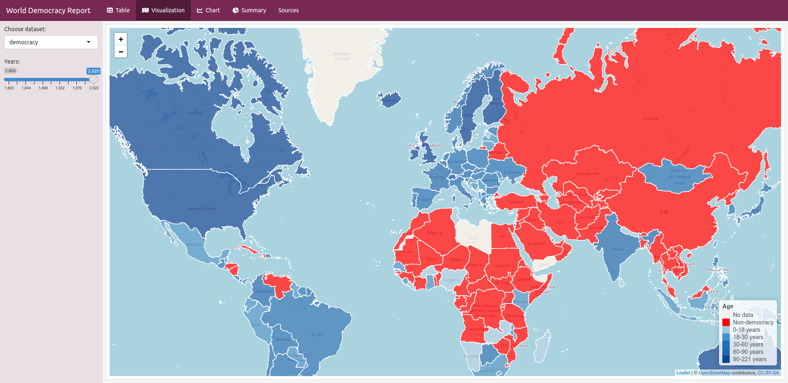

# World Democracy Report

# Description

This app is showing democracy systems in the world. Democracy has been divided into _Liberal democracy_ and _Electoral democracy_. The aim of the project is to show how many years countries have been democratic.

The app uses the following datasets:

- Democracy Dataset (1800-2020)
- Liberal Democracy Dataset (1789-2022)
- Electoral Democracy Dataset (1789-2022)

**The author does not suggest the correctness of the borders of countries and does not state the form of government of these countries, but only presents data.**

## Features

For better visualization, the application uses:

- dynamically changing data sets
- a table with sorting and filtering capabilities
- an interactive map
- interactive charts divided by regions
- info page with definitions and credits

## Technologies

This application was created in R as a dashboard. It uses the following libraries:

- flexdashboard
- tidyverse
- DT
- leaflet
- sp
- rnaturalearth
- plotly
- ggplot2

# Credits

This application uses information from the article "In most countries, democracy is a recent achievement. Dictatorship is far from a distant memory" by Bastian Herre (2022). Retrieved from: [Our World in Data](https://ourworldindata.org/democracies-age). Democracy dataset is based on the classification and assessment by Boix et al. (2013). Liberal and Electoral datasets are based on the criteria of the classification by Lührmann et al. (2018) and the assessment by V-Dem’s experts.
